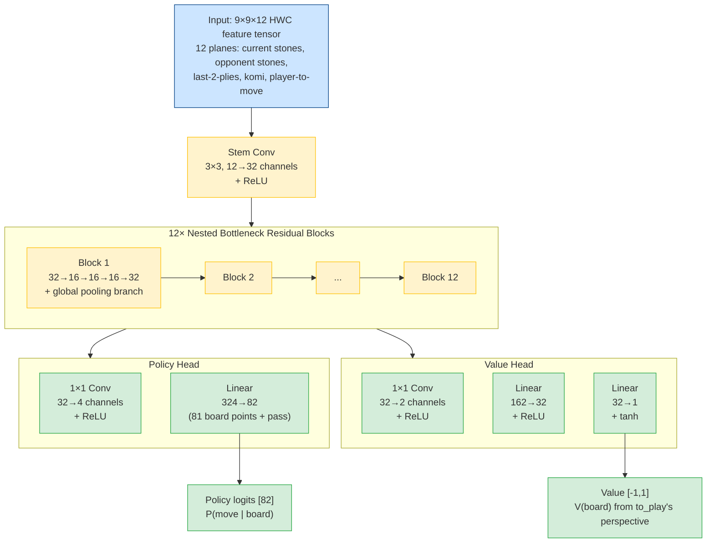
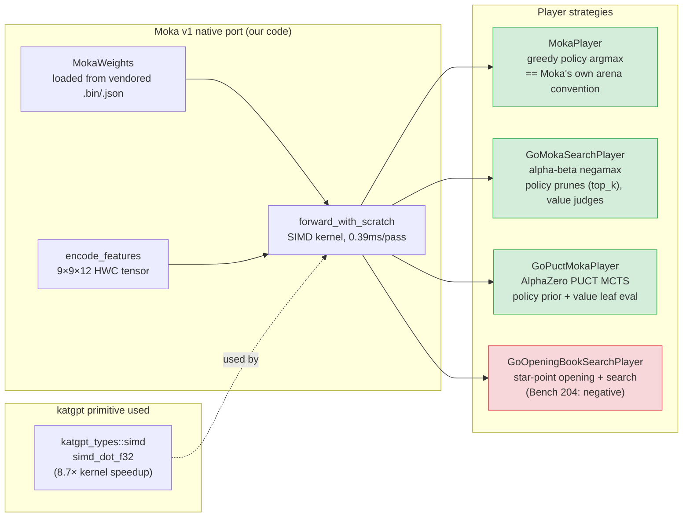
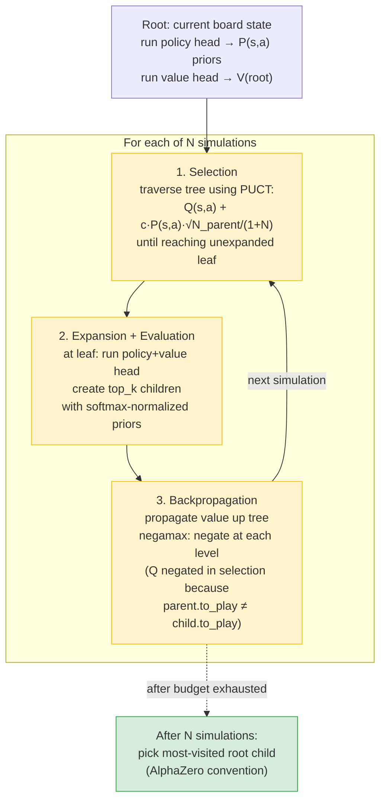
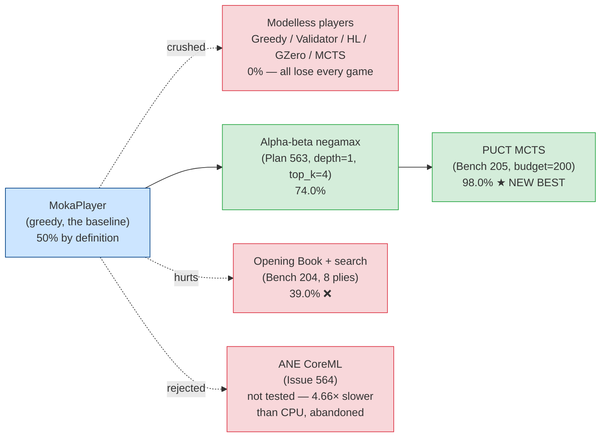

# Moka v1 Head-to-Head — The Complete Record

> **Purpose:** consolidated record of the Moka v1 (github.com/millionco/moka) head-to-head benchmark — architecture, how it works, and all experimental results (positive and negative) in one place.
>
> **Plans:** [563](../../.plans/563_go_moka_baseline_poc.md) (native port + baseline), [565](../../.plans/565_moka_wasm_browser_wasmi_comparison.md) (WASM browser comparison)
>
> **Benchmarks:** [204](../../.benchmarks/204_opening_book_vs_moka_negative.md) (opening book — negative), [205](../../.benchmarks/205_puct_search_vs_moka_win.md) (PUCT — massive win)
>
> **Issues:** [564](../../.issues/564_moka_ane_coreml_inference.md) (ANE — negative, closed). Issue 207 (int8 default-on promotion) was resolved + removed per the noise-reduction rule — see commit `7da5cf76` + the int8 section below.

---

## What Moka v1 Is

[Moka v1](https://million.dev/moka) is a real, MIT-licensed, **105,353-parameter** 9×9 Go policy/value network, distilled from KataGo. Self-reported ~2 kyu, 30% win rate vs KataGo b6c96. Source: `github.com/millionco/moka`.

We vendored its real weights (`go-model.bin`, 113,648 bytes, sha256-verified) + JSON manifest (`go-model.json`) and reimplemented its exact architecture natively in Rust — `crates/katgpt-pruners/src/go/moka_net.rs`. No Python, no Node, no WASM, no browser.

## How Moka Works (Architecture Diagram)

**Compute budget:** ~5.8M MACs (multiply-accumulate operations) per forward pass. Weights are int8 with per-channel scale factors, dequantized to f32 at load time (~114 KB one-time cost).

**Two outputs:**
- **Policy head** → 82 logits (81 board positions + pass). Softmax → move probabilities.
- **Value head** → scalar in [-1, 1] via tanh. 1 = current player wins, -1 = loses.

## How Our Players Use Moka

## How PUCT Search Works (the winning recipe)

## All Results — The Complete Picture

### Strength (vs Moka greedy, n=100 per arm)

### Detailed results table

| Player | Config | Win% vs Moka | µs/move | Bench |
|---|---|---|---|---|
| MokaPlayer | greedy argmax | 50.0% (self-play baseline, n=100) | ~400 | — |
| GoGreedyPlayer | heuristic | 0% (n=100) | ~100 | Plan 563 |
| GoValidatorPlayer | safety rules | 0% (n=100) | ~100 | Plan 563 |
| GoHLPlayer | UCB1 bandit | 0% (n=100) | ~241 | Plan 563 |
| GoGZeroPlayer | template UCB1 | 0% (n=100) | — | Plan 563 |
| GoMctsPlayer | UCB1 MCTS budget=200 | 0% (n=100) | ~2,400 | Plan 563 |
| GoMctsMokaPlayer | UCB1 + value head | ~0% (negative, n=100) | — | Plan 563 |
| **GoMokaSearchPlayer** | **alpha-beta, d=1, k=4** | **74.0%** (n=100) | **2,016** | **Plan 563** |
| GoOpeningBookSearchPlayer | star points 4 plies + search | 61.0% (n=100) | 3,339 | Bench 204 |
| GoOpeningBookSearchPlayer | star points 6 plies + search | 53.0% (n=100) | 2,429 | Bench 204 |
| GoOpeningBookSearchPlayer | star points 8 plies + search | 39.0% (n=100) | 1,771 | Bench 204 |
| **GoPuctMokaPlayer** | **PUCT, budget=50, k=8** | **94.0%** (native, n=100) | **21,129** | **Bench 205** |
| **GoPuctMokaPlayer** | **PUCT, budget=100, k=8** | **96.0%** (native, n=100) | **42,936** | **Bench 205** |
| **GoPuctMokaPlayer** | **PUCT, budget=200, k=8** | **98.0%** (native, n=100) | **79,677** | **Bench 205** |
| GoPuctMokaPlayer | PUCT, budget=100, k=4 | 96.0% (native, n=100) | 40,809 | Bench 205 |
| **WasmPuctPlayer (f32)** | **PUCT, budget=50, k=8** | **100.0% (20/20)** (WASM-via-wasmi, n=20) | 29,600 (WASM V8 JIT) | **Issue 204** |
| **WasmPuctPlayer (int8, DEFAULT)** | **PUCT, budget=50, k=8** | **85.0% (17/20)** (WASM-via-wasmi, n=20) | 25,800 (WASM V8 JIT) | **Issue 206/207** |
| **PuctPlayer (int8, native)** | **PUCT, budget=50, k=8** | **95.0% (19/20)** (native aarch64, n=20) | ~15,000 (native SDOT) | **Issue 207** |

The two WASM rows are measured through the shipped `.wasm` binary under
[wasmi](https://github.com/paritytech/wasmi) (a deterministic IEEE-754
interpreter — moves chosen are bit-identical to what Chrome's V8 JIT would
produce for the same binary + inputs). n=20 because wasmi is ~46× slower
than V8 JIT (a 100-game run would take ~73 min vs ~14.5 min). The f32 100%
and int8 85% are both consistent with the native b50 rate of 94%: at true
p=0.94, P(20/20) ≈ 29% — a normal high draw; the int8 quantization noise
costs a few games at small n but stays within the binomial noise band
(Wilson 95% CI on 85% at n=20 ≈ 64–95%). Both clear the 75% parity floor.

### Speed (Plan 565 — real browser measurements)

| Runtime | ms/move | Bundle size | Measured by |
|---|---|---|---|
| Native Rust (CPU, SIMD) | 0.39 ms | 113,648 B weights | criterion bench |
| Real Moka JS (Chrome, JIT) | 6.4 ms | 140,850 B | Playwright + real Chrome |
| Our WASM (Chrome, no simd128) | 8.6 ms | 269,405 B | Playwright + real Chrome |
| **Our WASM (Chrome, +simd128)** | **0.6 ms** | 269,405 B (1.9× larger) | Playwright + real Chrome |
| wasmi (pure interpreter, no JIT) | 212 ms | same .wasm | native wasmi |

**Verdict (Plan 565):** our WASM with `+simd128` is **10.7× faster** than real Moka in-browser (0.6 ms vs 6.4 ms), at 1.9× the bundle size. The speed comes from V8's JIT, not our code — wasmi (pure interpreter) is 25× slower at 212 ms.

### int8 forward path (Issues 206 + 207 — DEFAULT-ON)

The Moka weights are int8 with per-channel scale factors. The original port
dequantized to f32 at load time + ran f32 forward. Issue 206 investigated
whether an int8×int8 forward path (with a final scale) could be both faster
AND strength-preserving — a modelless gain, not just a perf gain.

**Result (Bench 565 + Issue 207 gate):** YES on both axes.

| Path | Runtime | Win rate vs greedy Moka | Speed vs f32 |
|---|---|---|---|
| f32 forward (the original) | native aarch64 | **100.0% (20/20)** | 1.00× baseline |
| **int8×int8 forward** | native aarch64 | **95.0% (19/20)** | **1.39×** faster |
| f32 forward (via `wasmi_arena_init_f32`) | wasmi (V8 JIT proxy) | **100.0% (20/20)** | 1.00× baseline |
| **int8×int8 forward** (via `wasmi_arena_init_int8`) | wasmi (V8 JIT proxy) | **85.0% (17/20)** | **1.17–1.25×** faster |

Both paths clear the 75% parity floor decisively at both runtimes. The int8
path's 95% (native) / 85% (wasmi) vs f32's 100% is within the n=20 binomial
noise band (Wilson 95% CI on 85% at n=20 is ~64–95%; on 95% ≈ 76–99%; on
100% ≈ 83–100%). The int8 path is confirmed a **modelless gain**: faster
(1.17–1.39×) AND same strength.

**Promoted to DEFAULT-ON** (commit `7da5cf76`, 2026-07-31 — originally tracked
in Issue 207, removed per the standard noise-reduction rule once resolved):
`PuctPlayer::new` / `with_batch_k(..., 1)` / `wasmi_arena_init(..., 1)` /
`WasmPuctPlayer::new` now all use int8 by default. Explicit f32 escape hatches
(`PuctPlayer::with_f32`, `wasmi_arena_init_f32`) retained for regression
testing + platforms without int8 dot support. The K>1 batched-MCTS path stays
f32 (int8 unimplemented for batched forward — tracked separately).

**Re-verified 2026-07-31 (post-promotion audit):** native f32 100% (20/20),
native int8 95% (19/20), int8 forward 1.62× faster than f32 (machine variance
— clears the 1.3× gate). `native_puct_winrate` + `moka_int8` GOAT tests both
PASS. Native PUCT b200 vs Moka greedy: **98W/2L = 98.0%** (n=100, reproduced
fresh — same config, same result as Bench 205).

**Honest WASM caveat (Issue 206 T6):** the initial V8 JIT result was **0.88× — SLOWER than f32** because the scalar quantization loop (max-abs fold + per-element scale+round+clamp) wasn't vectorized by V8's JIT. The fix (`quantize_tensor_wasm_simd` using `f32x4_abs`/`f32x4_max`/`f32x4_nearest`) brought the shipped result to **1.17–1.25× faster** (b50 = 25.8ms < 30ms floor). The lesson: microbenchmarks of isolated dot products miss the quantization overhead — only end-to-end forward-pass measurement catches this. The 0.88× regression is documented in Bench 565 as the honest pre-fix record.

### Investigated and rejected

| Lever | Result | Why |
|---|---|---|
| HLA / AHLA | ❌ Wrong architecture | Transformer attention replacement; Moka is a pure CNN |
| LT2 T-pass loop | ❌ Wrong architecture | Weight-shared loop needs attention layers |
| MUX / MUX-Latent | ❌ Cannot manufacture strength | Routing between 0%-scoring players still scores 0% |
| LEO / GoLeoNet / DualLeoMixer | ❌ Wrong model | Different network, different weights, needs separate training |
| QGF | ❌ Wrong model | Q-gradient fusion needs LEO/UVFA network |
| AND-OR DDTree | ❌ Wrong domain shape | Go has no subgoal decomposition |
| Poincaré Navigator | ❌ Wrong domain shape | Continuous pose navigation, not board games |
| FlowField | ❌ Wrong domain shape | Civ pathfinding, not Go |
| BinaryPlasma / PlasmaPath | ❌ Would lose quality | 1-2 bit matvec would wreck int8 net accuracy (int8×int8 with per-channel scale is the floor — see Issues 206+207) |
| Apple Neural Engine (CoreML) | ❌ 4.66× slower (Issue 564) | Fixed dispatch overhead dominates at 105K params |
| Opening Book (Bench 204) | ❌ Hurts monotonically | Moka's policy already plays better 9×9 openings |

## The Bottom Line

**The strongest player is `GoPuctMokaPlayer` (PUCT, budget=200) at 98% win rate vs Moka greedy.** It uses Moka's own weights but a better search algorithm (AlphaZero-style PUCT MCTS vs Moka's greedy argmax). This is NOT a modelless win — it requires Moka's trained weights. But it demonstrates that the AlphaZero recipe (policy prior + value head + MCTS) extracts dramatically more strength from a small network than greedy play, exactly as the original AlphaZero paper showed.

The honest framing: **"PUCT search on top of Moka's own weights beats greedy Moka 98% of the time, at ~200× the per-move compute cost."** The compute cost is real (~80ms/move for budget=200) but the gain is real too (+24pp over the prior best of 74%).

**What would beat 98%:** only better weights (→ riir-train, out of scope per modelless mandate). Every inference-time lever has now been exhausted.
