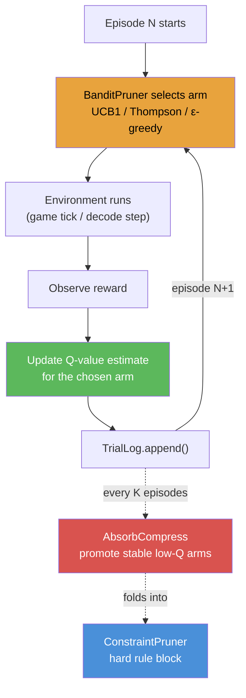
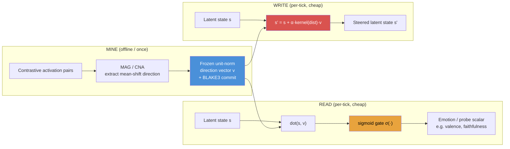
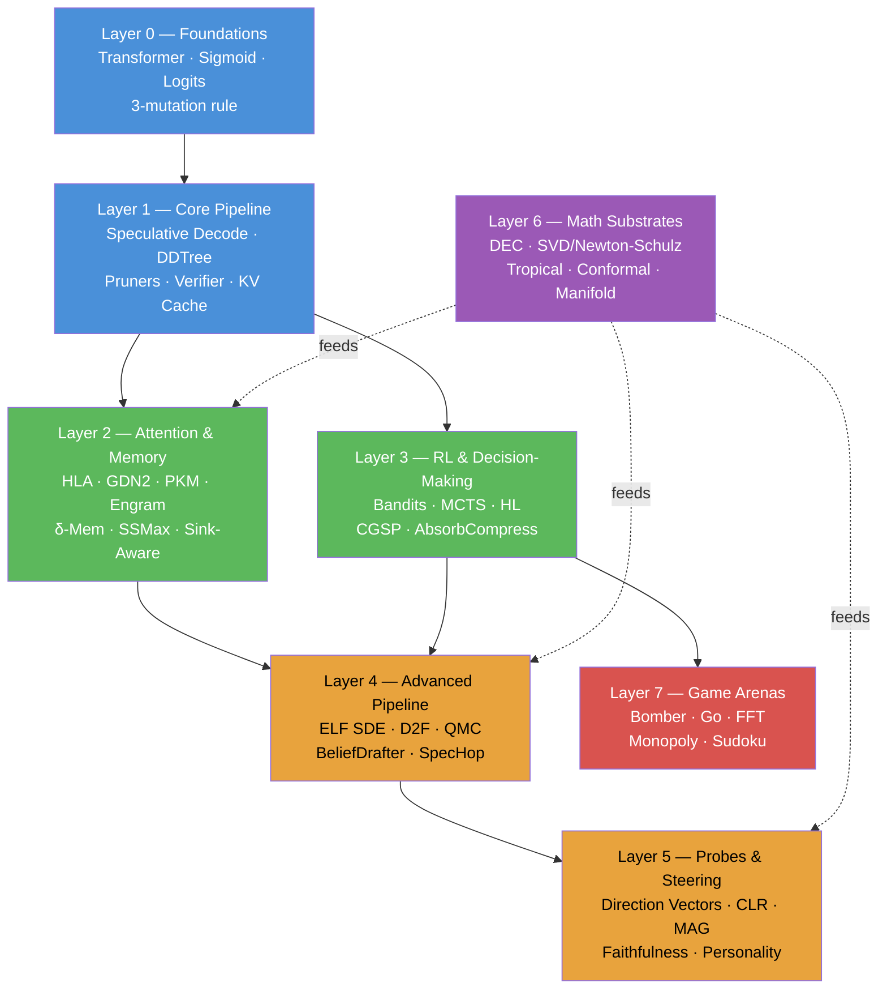

# katgpt-rs AI Keywords Learning Path

> Generated 2026-07-17. A structured prerequisite map for understanding the AI-related concepts in this codebase.
> Layers 0→1 are mandatory and sequential. After that the graph **branches** (Layer 2 ∥ Layer 3) and Layer 6 is a cross-cutting math substrate — see the DAG at the bottom before committing to a linear read.

---

## Layer 0: Foundations (Understand These FIRST)

> **Difficulty: ★☆☆** — mostly standard ML, plus 3 project-specific mutation rules.
> **"External resource"** = where to learn the *concept*. Later layers use **"Depends on"** = which earlier *keywords* you must already grasp (not files).

These are standard AI/ML concepts plus the three weight-mutation rules that define the whole architecture. If you know the ML basics, focus on the **bold project-specific** rows.

| Keyword | What it means in this project | External resource |
|---|---|---|
| **Transformer** | GPT-2 style: embedding → multi-head attention → MLP → logits. The `forward_base()` function. | [Illustrated Transformer](https://jalammar.github.io/illustrated-transformer/) |
| **Attention (SDPA)** | Scaled Dot-Product Attention: `softmax(QK^T/√d) · V`. The default hot path. | [Attention Is All You Need](https://arxiv.org/abs/1706.03762) |
| **Sigmoid** | `σ(x) = 1/(1+exp(-x))`. **Project design rule #1: sigmoid for ALL gating/routing, NEVER softmax.** | AGENTS.md |
| **Softmax** | `exp(x_i)/Σexp(x_j)`. Used ONLY for attention *retrieval* (competitive selection), never for routing/gating. | — |
| **Logits** | Raw unnormalized scores from the LM head, before temperature/sampling. | — |
| **Token / Vocabulary** | Discrete symbols; vocab_size=27 (micro) to 256K (Gemma2). Tokenization = text ↔ integers. | — |
| **BPE Tokenizer** | Byte-Pair Encoding — the actual tokenizer for the BPE-scale configs (+ ConvexTok/ToaST variants). | `crates/katgpt-tokenizer/` |
| **Inference** | Running a trained model forward with no learning. This entire repo is inference-only. | — |
| **Embedding** | Learned lookup table mapping token IDs → dense vectors (`wte[token]`). | — |
| **RMSNorm** | Root Mean Square Layer Normalization — cheaper than LayerNorm, used throughout. | — |
| **Temperature** | Scalar dividing logits before sampling — controls randomness. | — |
| **Entropy** | `H = -Σ p·log(p)` — measures uncertainty in a distribution. Used everywhere as a routing signal. | — |

### The Modelless Mandate + its 3 allowed weight mutations (READ THIS — it defines everything)

The repo ships **modelless** inference: no training, no backprop, no gradient descent at runtime. The ONLY runtime weight changes allowed are:

| Mutation | What it means | Why it matters |
|---|---|---|
| **Freeze / Thaw** | Atomically swap a frozen snapshot (versioned, BLAKE3-checked) | How "learning" persists without gradients |
| **Raw / LoRA hot-swap** | Apply a **deterministically constructed** (not trained) LoRA overlay | Adapts behavior without touching base weights |
| **Latent-space update** | Direction-vector projections, sigmoid gates, routing tables | Updates latent state, NOT base weights (see Layer 5) |

| Keyword | What it means | External resource |
|---|---|---|
| **LoRA** | Low-Rank Adaptation: `W' = W + (α/r)·B·A` — a small rank-r overlay on a frozen weight matrix. | [LoRA paper](https://arxiv.org/abs/2106.09685) |
| **BLAKE3** | Cryptographic hash used for commitment/tamper-detection on every frozen artifact. | The trust anchor for freeze/thaw + sync |

### Prerequisites from outside AI:
- **Rust traits** — the architecture is trait-based (`ConstraintPruner`, `ScreeningPruner`, etc.)
- **SIMD** — NEON/AVX2 vectorized kernels power the hot paths
- **Feature flags** — Cargo features gate every primitive; 378 total, ~155 default-on

### Key insight:
This isn't a training framework. It's a **frozen-model inference engine** where all adaptation happens through freeze/thaw snapshots, deterministic LoRA overlays, and latent-space direction vectors. Internalize the 3-mutation rule now — every later feature is one of these three in disguise.

---

## Layer 1: Core Inference Pipeline

> **Difficulty: ★★☆** — the heart of the system. Everything else optimizes or extends this.

> **The single most important thing**: `LLM drafts logits → ConstraintPruner filters → DDTree searches → Verifier accepts`

| Keyword | Role in the pipeline | Depends on | Where in code |
|---|---|---|---|
| **Speculative Decoding** | Draft multiple tokens cheaply, verify in batch for speedup | Transformer, logits | `crates/katgpt-speculative/` |
| **DDTree** | Best-first tree from marginal log-probabilities — the candidate search structure | Logits, tokens | `crates/katgpt-speculative/src/dd_tree.rs` |
| **ConstraintPruner** | Binary gate: `is_valid(depth, token, parents) → bool` | DDTree | `crates/katgpt-core/src/traits.rs` |
| **ScreeningPruner** | Graded relevance: `relevance(depth, token, parents) → f32` | DDTree | `crates/katgpt-core/src/traits.rs` |
| **SpeculativeGenerator** | Generic generate+validate contract | Speculative decoding | `crates/katgpt-core/src/traits.rs` |
| **DFlash** | Fast marginal prediction (draft model) | Speculative decoding | `crates/katgpt-speculative/src/dflash.rs` |
| **LeviathanVerifier** | p/q rejection sampling — preserves exact target distribution | Speculative decoding | `crates/katgpt-speculative/src/verifier.rs` |
| **KV Cache** | Stored past K/V vectors for autoregressive generation | Attention | `src/transformer.rs` |
| **Sparse MLP (TwELL)** | Skip dead ReLU neurons in the w2 matmul — always-on hot-path kernel | Transformer | `katgpt-types` (`sparse_mlp`) |
| **Domain Latent** | Mid-layer K/V injection for per-domain conditioning — always-on hot path | KV Cache | `src/transformer.rs` (`domain_latent`) |
| **Breakeven Routing** | Cost-aware tier selection (49% wallclock savings on long seqs), default-on | Cost model | `crates/katgpt-core/` (`breakeven_routing`) |
| **GOAT Gate** | The promotion proof: G1 correctness + G2 perf + G3 no-regression + G4 alloc-free | Engineering | `.benchmarks/` |
| **Feature Flag Discipline** | Opt-in → GOAT pass (modelless gain) → promote to default-on | Engineering | `Cargo.toml`, AGENTS.md |

### Key insight:
The project doesn't train models — it builds the **search and verification infrastructure** around a frozen model's logits. Every feature is a way to make that search faster, smarter, or more constrained.

---

## Layer 2: Attention Variants & Memory Systems

> **Difficulty: ★★★** — mostly linear algebra + signal processing. **Parallel with Layer 3** — read whichever matches your interest (attention/memory here, decision-making there); neither requires the other.

Once you understand the default SDPA pipeline, these are the O(1) alternatives and memory primitives.

| Keyword | What it is | Why it exists | Depends on |
|---|---|---|---|
| **HLA / AHLA** | Higher-order Linear Attention — O(1) constant-state per head | Replaces O(N) KV cache growth with fixed-size outer-product state | Attention, KV Cache |
| **GDN2 (Gated DeltaNet-2)** | O(1) recurrent attention with decoupled erase/write gates | Default-on alternative: constant state instead of growing cache | Attention, delta-rule |
| **DashAttention** | α-entmax adaptive sparse routing (replaces fixed top-k) | Sparse attention that adapts support size per query | Attention |
| **Parallax Attention** | Streaming covariance correction `o = o_SA − Σ_KV · ρ` | Upgrades Nadaraya-Watson estimator to local-linear | Attention, linear algebra |
| **Raven RSM** | Fixed-slot top-K routing memory, frozen unselected slots | O(1) slot memory with selective update | KV Cache |
| **Engram** | Hash-addressed sigmoid-fused static pattern memory | O(1) N-gram lookup → sigmoid gate → residual fuse | Sigmoid, hashing |
| **δ-Mem (Delta Memory)** | Rank-r associative memory via the delta rule `S' = (1−β)S − β(S·k)⊗k + β·v⊗k` | O(r) online key→value association without training (Plan 053) | KV Cache, delta-rule |
| **Product Key Memory (PKM)** | O(√N) factored retrieval via split-query codebook scoring | Scales to millions of slots at sub-linear cost | Memory retrieval |
| **MicroRecurrentBeliefState** | Per-entity recurrent kernel (attractor / leaky-integrator) | Maintains belief state across ticks without growing memory | Sigmoid, state-space |
| **BoMSampler** | K-hypothesis single-pass belief sampling via noise queries | Diverse next-states in one batched evaluation | BeliefKernel |
| **KV Compression (Hybrid OCT+PQ)** | Octahedral triplet + 2D Givens rotation codec | 64× fewer FMAs, best MSE — the default KV storage format | KV Cache, quantization |
| **SpectralQuant** | Eigenbasis rotation + water-fill bit allocation | Secondary KV codec using calibrated spectral structure | Linear algebra, KV Cache |
| **SSMax** | Length-aware `s_L·log(N)` temperature rescaling | Cancels attention dilution at million-token scale | Attention, softmax |
| **Sink-Aware Attention** | NOP/Broadcast classifier + dual-policy gate | Stop over-suppressing useful broadcast sinks under sigmoid | Attention, sigmoid |
| **LoRA-Muon (Gauge-Invariant Composition)** | Newton-Schulz inv-sqrt + gauge rebalance to compose adapters | Compose frozen LoRA overlays without factorization artifacts | LoRA, Newton-Schulz (L6) |

### Key insight:
The project ships **5 attention mechanisms** (SDPA, HLA, GDN2, DashAttn, Parallax) + **4 memory retrieval complexity classes** (Raven O(1), Engram O(1)-hash, δ-Mem O(r), PKM O(√N)). Each is optimal for a different slot-count / sequence-length regime.

---

## Layer 3: Reinforcement Learning & Decision-Making

> **Difficulty: ★★☆** — standard RL/bandit theory, but note the twist: no gradients. **Parallel with Layer 2.**

The project uses RL concepts but **without training** — bandits update Q-values from rewards, no gradient descent.

**Why this matters:** the loop `select → observe reward → update Q → repeat` never touches a weight matrix or gradient. "Learning" here means Q-value updates in a lookup table, and — via `AbsorbCompress` — eventually promoting a stable pattern into a hard-coded rule.

| Keyword | What it is | Why it exists | Depends on |
|---|---|---|---|
| **Multi-Armed Bandit (MAB)** | K arms, pull one per round, observe reward, update estimate | Core decision-making primitive — replaces gradient updates | Probability |
| **UCB1** | `mean + c·√(ln(N)/n_i)` — deterministic exploration bonus | Default bandit strategy (O(log N) regret) | MAB |
| **Thompson Sampling** | Sample from Beta(α,β) posterior, pick argmax sample | Bayesian exploration — better empirically on many problems | MAB, Bayesian inference |
| **ε-greedy** | Random arm with probability ε, best arm otherwise | Simple exploration with decay annealing | MAB |
| **Q-value** | Estimated mean reward per arm | The "knowledge" the bandit accumulates | MAB |
| **Regret** | Gap between optimal cumulative reward and actual | Measures how good the bandit is | MAB theory |
| **BanditPruner\<P\>** | MAB wrapping a ScreeningPruner — adaptive relevance scoring | Bridge between RL and the pruner trait system | MAB, ScreeningPruner |
| **MCTS** | Monte Carlo Tree Search: select → expand → rollout → backprop | Game-playing search (Bomberman, Go, FFT arenas) | GameState, MAB |
| **GameState trait** | `available_actions()`, `advance()`, `is_terminal()`, `reward()` | Generic game interface for MCTS/arenas | Traits |
| **Heuristic Learning (HL)** | Systems evolve through code/rule updates, not weight updates | The paradigm: feedback → agent edits rules → better system | Bandits |
| **AbsorbCompress** | Promote stable low-Q arms to hard constraint blocks | Rule compression — folds bandit knowledge into ConstraintPruner | MAB, ConstraintPruner |
| **HintDelta (G-Zero)** | `δ = log π(a|hint) − log π(a|no_hint)` — intrinsic reward | Self-play signal without external verifier | Logits, self-play |
| **CGSP** | Curiosity-Guided Self-Play (Solver/Conjecturer/Guide triad) | Modelless exploration with collapse recovery | MAB, curiosity |
| **Manifold Bandit** | Hierarchical Thompson sampling over a latent task tree | Structure-aware bandit for clustered arm spaces | Thompson, clustering |
| **Dual-Pool Router** | E-pool (exploit) + X-pool (explore) with sigmoid routing | Proactive non-trapping: provably never stuck | MAB, sigmoid |
| **SR²AM Configurator** | Per-turn PlanNew/PlanExtend/PlanSkip bandit | Learned planning-depth regulation | MAB, entropy |

### Key insight:
**Heuristic Learning = bandits + trait system.** The `BanditPruner` learns which tokens/actions are good across episodes. `AbsorbCompress` folds this into hard rules. No gradient — just Q-value updates from binary rewards.

---

## Layer 4: Advanced Speculative & Generative Pipeline

> **Difficulty: ★★★** — builds directly on Layer 1; each row is one paper's distilled trick.

Extensions to the core draft-verify loop.

| Keyword | What it is | Why it exists | Depends on |
|---|---|---|---|
| **ELF SDE** | Logit-normal noise injection into DDTree marginals | 10-22× path diversity without changing tree budget | DDTree, stochastic processes |
| **BeliefDrafter (NextLat)** | 3-layer residual MLP predicting next hidden states | Self-speculative drafting at near-zero overhead (17µs/step) | Speculative decoding, MLP |
| **PPoT** | CPU logit resampling at high-entropy "key" positions | Exponentially many variants from one GPU pass — zero extra cost | Logits, entropy |
| **ThoughtFold (Chain Folding)** | Prune redundant CoT reasoning steps via importance scoring | ≥30% token reduction, ≤2% accuracy regression | CoT, attention |
| **Collapse-Aware Thinking** | Runtime reasoning collapse detection → early exit | 50-90% token savings on simple tasks | Entropy, CoT |
| **SwiR Switch-Thinking** | Explicit ↔ latent reasoning mode controller via entropy trends | Asymmetric dwell windows prevent mode chatter | Entropy, CoT |
| **D2F (Discrete Diffusion Forcing)** | Block-parallel denoising decode (bidirectional within block) | Alternative to AR: decode 8+ tokens simultaneously | Diffusion, attention masks |
| **FlashAR Consensus** | Dual-path ternary thermal routing (Plasma/Hot/Warm/Cold) | Consensus between AR and D2F paths | D2F, speculative |
| **QMC Sampling** | Quasi-Monte Carlo (Lattice/Stratified/Sobol) for K-rollout paths | Lower variance than iid at fixed K — 25-47% fewer rollouts needed | Sampling theory |
| **SpecHop** | Hop-level (tool-call granularity) speculation | Extends draft-verify from tokens to entire tool-call observations | Speculative decoding |
| **TRDraft** | Trajectory-Refined Draft — re-draft failed DDTree branches | When verifier rejects, refine from failure point with noise + pruner | DDTree, ELF SDE |
| **MUX-Latent** | Zero-training context compression via vocabulary superposition | 29× TTFT speedup, 93.8% KV memory reduction | KV Cache, latent space |
| **PFlash** | Block-sparse speculative prefill | 21× sequence reduction, 100% NIAH retrieval | Prefill, attention |

### Key insight:
The speculative pipeline has **three axes of diversity**: (1) SDE noise on marginals, (2) multiple DDTree branches, (3) QMC-correlated rollouts. All three are orthogonal and compose.

---

## Layer 5: Calibration, Probes & Latent Steering

> **Difficulty: ★★★** — this is the "latent-space update" mutation from Layer 0, fully realized.

Primitives that **read from** or **write to** the latent state without training.

**Why this matters:** every primitive in this layer is one of exactly three operations on the *same* frozen direction vector — mine it once, then either dot-product-read it (probes, emotion, CLR) or inject-write it (steering, personality). Never softmax; always sigmoid (Layer 0 rule).

| Keyword | What it is | Why it exists | Depends on |
|---|---|---|---|
| **Direction Vector** | Frozen unit-norm `[f32; D]` for sigmoid-gated dot-product projection | The universal read/write primitive for latent state | Sigmoid, linear algebra |
| **Latent Field Steering** | Inject `s' = s + α·kernel(dist)·v` into mutable latent state | Top-down control (emotion, faction, fear) via wave interference | Direction vectors |
| **Subspace Steering** | k-dim orthonormal block + per-axis strengths — manifold walking | Generalization of 1D steering to k-dim concept sweeps | Direction vectors, Gram-Schmidt |
| **Spherical Steering** | Geodesic Slerp rotation toward unit-norm target on S^{d-1} | Norm-preserving (unlike linear steering which can blow up norms) | Geometry, direction vectors |
| **Emotion Directions** | Read valence/arousal/desperation/calm from mid-layer activations | Zero-cost O(d) dot product per step — "emotion thermometer" | Direction vectors |
| **FaithfulnessProbe** | 5 causal interventions → is injected memory actually used? | Catches "dead injections" that consumers silently ignore | Causality, intervention |
| **CLR (Claim-Level Reliability)** | `r_k = (mean σ(dot(claim, dir)))^M` — nonlinear reliability gate | Single mediocre verdict drags reliability super-linearly | Sigmoid, voting |
| **CNA Steering** | Contrastive Neuron Attribution + sparse runtime modulation | Discover which neurons causally drive a behavior, then modulate | Interpretability |
| **Renoise-CE** | Perturb output → re-resolve → measure drift as self-verification | Operator-agnostic: no labels, no verifier head, just fixpoint structure | Self-consistency |
| **Indicator Probe Bank** | N pre-committed direction vectors, OR-fused into a firing label | Structured multi-direction cognitive-indicator detection | Direction vectors, BLAKE3 |
| **MAG (Mining via Activation Geometry)** | Unsupervised direction mining from self-labeled activation shifts | The missing acquisition step — mines directions without human labels | Direction vectors, geometry |
| **Depth-Invariance Diagnostic** | Classifies state chains as DepthInvariant/Refinement/Collapsed | Root-cause attention-drift detector (not just a symptom flag) | Linear algebra, statistics |
| **Salience Tri-Gate** | Three-way per-tick decision: Speak / Silent / Delegate | Two stacked sigmoids — silence is a first-class variant | Sigmoid, decision-making |
| **PersonalityWeightedComposition** | `Σ sigmoid(w/τ)·confidence·direction` — per-entity behavior blend | Emergent personality adaptation without retraining (drift rule) | Sigmoid, direction vectors |
| **CommittedFieldBlend** | Frozen sigmoid blend of N archetype fields, BLAKE3-committed | Sampling-invariant: fog-of-war / desync don't change personality | Sigmoid, BLAKE3, fields |

### Key insight:
The **direction vector** is the universal primitive. Everything in this layer is either:
1. **Mining** directions (MAG, CNA)
2. **Reading** from directions (Emotion, Probes, CLR)
3. **Writing** via directions (Steering, Personality, CommittedBlend)

---

## Layer 6: Mathematical Substrates

> **Difficulty: ★☆☆ to ★★★★** — ranges from undergrad SVD to graduate differential topology (Linking Number). Pick per-row.
>
> ⚠️ **This layer is NOT sequential-after-Layer-5.** It's a **cross-cutting substrate**: DEC feeds Layer 2 (zone cochains) and Layer 4 (Heat Kernel); SVD/Newton-Schulz feed Layer 2 (LoRA-Muon) and Layer 5 (MANCE erasure, subspace steering). Read a row only when a higher layer references it.

Pure math that other layers consume. You don't need these to understand the AI *concepts*, but you need them to understand the **proofs and implementations**.

| Keyword | What it is | Why it exists | Depends on |
|---|---|---|---|
| **DEC (Discrete Exterior Calculus)** | Cell complexes + cochain fields + d/δ/Δ operators | Conservation-guaranteed spatial reasoning (threat/safety/interest fields) | Differential geometry |
| **Tropical (max,+) Algebra** | `(max, +)` semiring — worst-case/bottleneck aggregation | Critical-path scheduling, max-of-sums routing | Abstract algebra |
| **Newton-Schulz** | 5-iteration cubic fixed-point orthogonalization | Muon-family optimizer weight conditioning (LoRA-Muon) | Linear algebra |
| **SVD / Jacobian SVD** | Singular Value Decomposition — subspace discovery at runtime | Phase-transition gate (N≥d), spectral rewiring, MANCE erasure | Linear algebra |
| **Tucker / HOSVD** | N-mode tensor factorization via mode-n SVDs | Compact tensor representation for multi-dimensional data | Linear algebra, tensors |
| **Spectral Differentiation** | FFT-based `d^m/dx^m` on periodic grids | Specialized 1D operator (DEC is overkill for periodic 1D) | FFT, calculus |
| **Fourier Continuation** | Polynomial periodic extension to suppress Gibbs ringing | Makes FFT work on non-periodic data without boundary artifacts | FFT, approximation |
| **Heat Kernel** | `exp(t·Δ)·h₀` — single-shot field prediction via operator exponential | Exact at long horizons vs O(T·dt²) Euler error accumulation | DEC, linear algebra |
| **Conformal Prediction** | Coverage-guaranteed predictive intervals from residual quantiles | The UQ "floor" — every uncertainty-quantification primitive must beat it | Statistics |
| **Mean-Field Theory** | (κ, κ_a, Q) order parameters + Hopf bifurcation boundary | Crowd oscillation regime classification (Static/NSO/IS/GLC) | Statistical physics |
| **Viable Manifold Graph** | Safe-navigation on discrete viability-constrained latent graphs | 100% playability vs 74% for unconstrained walks | Manifold theory, graphs |
| **Linking Number (Gauss integral)** | Topological invariant detecting linked manifolds | Proves sigmoid projections can't separate linked classes → fold correction | Topology |
| **Kolmogorov Complexity / Levin Search** | Algorithmic probability — low-K candidates are more likely | Complexity-prior sampler: `sigmoid(-α·K̃(x))` weighted selection | Information theory |

---

## Layer 7: Game Arenas & Domain Proofs

> **Difficulty: ★★☆** — depends on **Layer 3** (bandits, MCTS, GameState), NOT Layer 6. Read after Layer 3.

Concrete domains that prove the HL thesis: **adaptive intelligence > static rules > random**.

| Keyword | What it is | Key result | Depends on |
|---|---|---|---|
| **Bomberman Arena** | 4-player tactical AI on procedural maps | HL +177 vs Random −55 | GameState, bandits |
| **Monopoly FSM** | 4-player turn-based with 8 phases, 40 squares | HL 56.5% win rate, +41.3pp over Validator | GameState, bandits |
| **FFT Tactics** | 4v4 ATB battle (6 classes, status effects) | TFT 99% win rate — game theory optimal | GameState, game theory |
| **Go (AutoGo)** | Full 9×9/19×19 with Tromp-Taylor scoring | Greedy/Validator/HL 100% vs Random 35% | GameState, MCTS |
| **NFSP/MCTS Duality** | Wire bandit Q-values into MCTS rollouts | BanditMCTS 75% vs plain MCTS 8% | MCTS, bandits |
| **Sudoku** | Path-aware ConstraintPruner | 7,079× compression on Inkala's Hardest | ConstraintPruner |
| **Deterministic Validator** | SynPruner filters invalid Rust syntax in DDTree | 100% valid branches (path-aware catches cross-depth conflicts) | ConstraintPruner |

### Key insight:
Every arena proves the same thesis with different game rules: **the bandit + constraint system outperforms hardcoded heuristics, which outperform random.** The system learns from binary win/loss rewards without gradient descent.

---

## Summary: The Prerequisite DAG

The layers are **NOT a single linear chain**. Layer 6 (math) is a cross-cutting substrate; Layers 2 and 3 are parallel; Layer 7 depends on Layer 3.

**Reading strategy:** L0 → L1 are mandatory and sequential. Then pick your track:
- **Inference/attention track:** L2 → L4 → L5
- **Game-AI/RL track:** L3 → L7
- Pull individual **Layer 6** math rows on-demand when a feature references them (dashed arrows above — it feeds multiple layers, it isn't "read after L5").

---

## Recommended Reading Order (files in this repo)

| Step | File | What you'll learn |
|------|------|-------------------|
| 1 | `AGENTS.md` | The modelless mandate, sigmoid rule, feature discipline |
| 2 | `README.md` §Architecture | Core pipeline, key traits, crate DAG |
| 3 | `.docs/01_orientation/architecture.md` | Full module-by-module reference |
| 4 | `.docs/02_inference/speculative_decoding.md` | DDTree, DFlash, verifiers, sampling |
| 5 | `.docs/06_game_arenas/heuristic_learning.md` | Bandits, HL, absorb/compress, arenas |
| 6 | `.docs/03_memory/` | Raven, PKM, Engram, Belief, Sleep |
| 7 | `.docs/04_calibration/` | CLR, probes, salience, sigmoid-vs-softmax |
| 8 | `.docs/05_adaptation/model_adaptation.md` | LoRA, prefill, HLA, domain latent |
| 9 | `crates/katgpt-core/src/traits.rs` | The 19 core traits (read the source) |
| 10 | `.docs/09_feature_catalog/opt_in_features.md` | Full feature flag reference + negative results |

---

## Glossary of Project-Specific Acronyms

> **Note on GOAT:** the codebase never spells out the acronym. It's used purely as the name of the promotion proof gate, with a tier hierarchy: **Gain** (a real but modest win) < **GOAT** (passes all gates G1–G4 with a modelless gain) < **Super-GOAT** (a fusion that beats any single component). Don't read an expansion into it.

| Acronym | Meaning in this codebase |
|---|---|
| GOAT | The promotion proof gate — G1 correctness / G2 perf / G3 no-regression / G4 alloc-free (tiers: Gain < GOAT < Super-GOAT) |
| DDTree | Draft-Decode Tree (best-first speculative search) |
| DFlash | Draft-Flash (fast marginal prediction) |
| SDPA | Scaled Dot-Product Attention (the default attention) |
| AR | Autoregressive (standard left-to-right token generation) |
| HLA / AHLA | Higher-order Linear Attention (symmetric / asymmetric) |
| GDN2 | Gated DeltaNet-2 |
| KV | Key/Value (the attention cache) |
| HL | Heuristic Learning (rule-update learning, no gradients) |
| CGSP | Curiosity-Guided Self-Play |
| CLR | Claim-Level Reliability |
| CNA | Contrastive Neuron Attribution |
| DEC | Discrete Exterior Calculus |
| δ-Mem | Delta Memory (rank-r associative delta-rule memory) |
| PKM | Product Key Memory |
| MAG | Mining via Activation Geometry |
| MCTS | Monte Carlo Tree Search |
| MAB | Multi-Armed Bandit |
| QMC | Quasi-Monte Carlo |
| SDE | Stochastic Differential Equation (here: logit noise injection) |
| PPoT | Probabilistic Programs of Thought (CPU logit resampling) |
| D2F | Discrete Diffusion Forcing (block-parallel denoising decode) |
| CoT | Chain-of-Thought (multi-step reasoning) |
| NIAH | Needle-In-A-Haystack (long-context retrieval benchmark) |
| LoRA | Low-Rank Adaptation (frozen-weight overlay) |
| CCE | Coarse Correlated Equilibrium |
| BoM | Best-of-Many (K-hypothesis sampling) |
| MUX | Multiplexed superposition encoding |
| SSMax | Scalable-Softmax (length-aware log-N temperature) |
| KARC | Kolmogorov-Arnold Reservoir Computing |
| TILR | Trajectory-Invariant Latent Refinement |
| MANCE | Manifold-Aware Concept Erasure |
| SR²AM | Self-Regulated Simulative Reasoning (configurator bandit) |
| UQ | Uncertainty Quantification (must beat the conformal "floor") |
