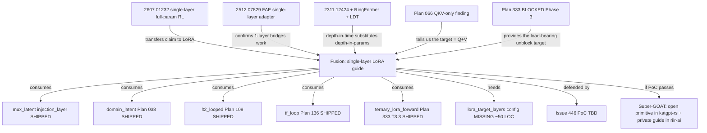

# Research 477: One-Layer Guide — Single-Layer LoRA × RL Steering × Ternary Base Fusion

> **Source:** Fusion of [arXiv:2607.01232 "Is One Layer Enough? Training A Single Transformer Layer Can Match Full-Parameter RL Training"](https://arxiv.org/abs/2607.01232) (Zhang, Hu, Glentis, Li, Yau, Lin, Hong; Jul 2026) × [arXiv:2512.07829 "One Layer Is Enough: Adapting Pretrained Visual Encoders for Image Generation"](https://arxiv.org/abs/2512.07829) (Gao, Chen, Chen, Gu; Dec 2025) × [arXiv:2311.12424 "Looped Transformers are Better at Learning Learning Algorithms"](https://arxiv.org/abs/2311.12424) (Yang et al., ICML 2024) × shipped substrate (`mux_latent`, `domain_latent`, `lt2_looped`, `tf_loop`, Plan 066 QKV-only finding, Plan 333 ternary unblock).
> **Date:** 2026-08-12
> **Status:** Active — fusion idea, verdict TBD pending PoC per research-skill §3.6 defend-wrong protocol
> **Related Research:** 018 (Free Transformer mid-layer latent injection), 028 (HLA — sister to QKV-only LoRA finding), 050 (LDT — recurrent deduction), 073 (LT2 looped), 097 (training-free looped), 110 (ternary CPU distillation), 165 (Q/K/V projection sharing), 414 (looped readout blind spot), 453 (variable-rank domain expert clusters)
> **Related Plans:** 038 (Free Transformer mid-layer injection — shipped, default-on), 066 (Fourier-AHLA LoRA — QKV-only finding), 108 (LT2 looped — shipped), 136 (tf_loop — shipped), 255 (LoTA-QAF ternary LoRA), 333 (BitNet ternary MoE PoC — **the load-bearing unblock target**), 423 (Gemma-2-2B fast baseline for LoRA GOAT gates)
> **Cross-ref (riir-train):** Issue 446 (single-layer LoRA target PoC — the defend-wrong gate for this note)
> **Classification:** Public

---

## TL;DR

**The fusion.** Three recent papers independently argue "one layer is enough" across three different axes: (1) single-layer **full-param** RL training recovers most of full-model RL gain (2607.01232, mid-layer concentration); (2) single-layer adapter bridges pre-trained encoder → diffusion (2512.07829, FAE); (3) single weight block executed recurrently matches deep stacks (2311.12424 + RingFormer + LDT). **No published paper has studied the intersection**: single-layer **LoRA** trained on one mid-layer of a frozen base, applied at RL post-training, on a ternary {-1,0,+1} backbone, with the inference-time substrate (`mux_latent`, `tf_loop`, `lt2_looped`) doing the layer-targeted routing.

**Distilled for katgpt-rs (modelless, inference-time):** the substrate primitives for *consuming* a single-layer-trained adapter at one mid-layer are **already shipped** — `MuxLatentConfig::injection_layer: Option<usize>` (defaults to `n_layer / 2`), `domain_latent` (Plan 038, default-on, injects at `layer_idx == n_layer / 2`), `tf_loop` (Plan 136, re-applies contiguous mid-stack block w/ ODE sub-stepping), `lt2_looped` (Plan 108, 1 weight block × K iterations). **What is NOT shipped** is the **training-side** primitive: `TrainingConfig::lora_target_layers: Option<Vec<usize>>` — `CpuLoraTrainer::new` (`riir-train-engine/src/cpu_lora_train.rs:500`) hardcodes `for _layer in 0..config.n_layer { for target in CpuLoraTarget::all() }`, training **all 6 targets × all layers** by default.

**What this unblocks (the load-bearing value):** Plan 333 Phase 3 is currently BLOCKED (Issue 445 closed, stop rule fired): ternary Bonsai-27B measures **0.27 tok/s** at seq_len=64 → ~286 s/step → 5× over the 60 s/step budget. The current trainer initializes **64 layers × 6 targets = 384 adapters** and computes LoRA gradients for all of them. If single-layer Q+V LoRA at the 2607.01232-identified mid-layer captures ~90% of the gain (the paper's claim, transferred to LoRA — **unproven for LoRA, this is the novel fusion claim**), then training **2 adapters instead of 384** is a **192× gradient-FLOP reduction** that could bring seq_len=64 under the 60 s/step budget and unblock the entire Phase 3.

**Honest verdict TBD.** The quality claim ("single-layer LoRA ≈ multi-layer LoRA on RL steering") is **not proven** — 2607.01232 proves it for full-param RL training, not for LoRA. This is the Q1–Q4 novelty gate question, and per research-skill §3.6 it requires a **defend-wrong PoC** (Issue 446) before any verdict upgrades to GOAT/Super-GOAT. The PoC will defend OR refute; either outcome is recorded.

---

## 1. Paper Core Findings

### 1a. arXiv:2607.01232 — *Is One Layer Enough? Training A Single Transformer Layer Can Match Full-Parameter RL Training*

- **Setting:** Post-training RL (GRPO, GiGPO, Dr. GRPO) on 7 models across Qwen3 + Qwen2.5, math/code/agentic tasks.
- **Method:** Introduces **"layer contribution"** metric — fraction of full-model RL improvement recovered by training one layer's **full parameter set** in isolation, with all other layers frozen.
- **Finding 1:** High-contribution layers **concentrate in the MIDDLE** of the stack (not first/last).
- **Finding 2:** Layer rankings **correlate strongly** across datasets, tasks, models, AND across the 3 RL algorithms — middle-layer concentration is structural, not task-specific.
- **Finding 3 (key claim):** Single-layer full-param RL training recovers **most** of full-model RL gain; in some cases surpasses it.
- **What it does NOT prove:** It does **not** benchmark single-layer **LoRA** vs multi-layer LoRA on RLHF/GRPO. The full-param result does not transfer to LoRA by reduction — LoRA constrains the update to a rank-r subspace, which may or may not align with the high-contribution directions the full-param training discovers.

### 1b. arXiv:2512.07829 — *One Layer Is Enough: Adapting Pretrained Visual Encoders for Image Generation* (FAE)

- **Setting:** Adapt pre-trained visual encoders (DINO, SigLIP) for image generation (diffusion, normalizing flows).
- **Method:** FAE (Feature Auto-Encoder) — a single attention layer projects pre-trained visual features into a low-dim latent suitable for generation, plus two decoders (reconstruct + generate).
- **Finding:** Single attention-layer adapter achieves near-SOTA (FID 1.29 on ImageNet 256² w/ CFG). The "single layer is enough" claim is empirically verified in the visual modality.

### 1c. arXiv:2311.12424 + RingFormer (2502.13181) + LDT (2605.08605) — Looped / Recurrent Transformers

- **Setting:** Replace deep unique-weight stacks with 1 weight block executed K times.
- **Finding:** Depth-in-time (recurrent unrolling) substitutes for depth-in-parameters. RingFormer and LDT extend to longer reasoning chains.
- **Already in this codebase:** `lt2_looped` (Plan 108 / Research 073) — `LoopMode` + `HybridPattern` + `forward_looped`, Bench 033 confirmed Hybrid 1:4 = 94% of pure SDPA T=4 throughput at 4.6× memory reduction. `tf_loop` (Plan 136) — training-free mid-stack re-application with ODE sub-stepping.

---

## 2. Distillation — the fusion (what no single paper covers)

**The unstudied intersection:** No paper has studied single-layer **LoRA** (rank-r constrained update, not full-param) trained on one mid-layer of a frozen base, at RL post-training, on a ternary {-1,0,+1} backbone, with the inference-time substrate doing layer-targeted routing.

| Axis | 2607.01232 | 2512.07829 | 2311.12424 | **This fusion** |
|---|---|---|---|---|
| Update type | full-param | full-param (1 layer) | full-param (1 block) | **LoRA (rank-r)** |
| Training regime | RL (GRPO/GiGPO/Dr.GRPO) | supervised | supervised + RL unrolling | **RL or supervised** |
| Target layer | mid (data-driven) | mid (encoder→decoder bridge) | whole stack recurrent | **mid (`n_layer/2`)** |
| Base | dense fp16 | dense fp16 (DINO/SigLIP) | dense fp16 | **ternary {-1,0,+1}** |
| Inference routing | n/a (still full deep) | n/a (1 adapter, no routing) | recurrent unrolling | **`mux_latent` + `tf_loop` + `lt2_looped`** |

**Why this combination is interesting (not just "yet another single-layer paper"):**

1. **Ternary base is the new constraint.** A ternary {-1,0,+1} base has 3 weight levels. Plan 333 §T3.3b already noted the impedance mismatch: `ternary_merge` clamps to int8 range; a ternary base + LoRA delta must stay two tensors forever unless the delta itself is ternary (LoTA-QAF Plan 255). Single-layer LoRA sidesteps the merge problem — only one layer's worth of base+delta needs bridging, not 64.

2. **The 192× gradient reduction attacks Plan 333's actual blocker.** Plan 333 Phase 3 isn't blocked on memory (23 GB RSS at N=4 is fine); it's blocked on **step time** (0.27 tok/s, 5× over budget). Of that step time, the per-layer LoRA backward is a meaningful fraction. Cutting 384 adapters → 2 adapters is the highest-leverage fix.

3. **The substrate for consuming a single-layer adapter already ships.** `MuxLatentConfig::injection_layer` + `domain_latent` (Plan 038) + `tf_loop` (Plan 136) compose to route a single-layer-trained adapter into the right place in the forward pass with zero new inference code.

4. **Plan 066 already proved QKV-LoRA works, MLP-only fails.** Fourier-AHLA LoRA distillation: KL 7.4→0.097 with QKV LoRA, fails (KL 9.4) with MLP-only. This is prior art on the *target* question — the answer is Q+V at one layer, not all 6 targets.

### Fusion: One-Layer Guide × LoTA-QAF ternary merge × Plan 333 unblock

The most direct fusion: train a single rank-16 LoRA on **Q + V at layer 32 (mid)** of frozen Ternary-Bonsai-27B, supervised on questbench CSPs. The forward path already ships (Plan 333 T3.3 — `ternary_lora_forward.rs` with `LoraDelta::{Dense, Ternary}`). The consumption substrate already ships (`mux_latent`, `domain_latent`). What's missing is the training-side `lora_target_layers` config — a ~50 LOC change.

**Prediction (to be defended or refuted by PoC):** single-layer Q+V LoRA at mid captures ≥70% of the questbench solve-rate gain that full 6-target × 64-layer LoRA would capture, at 1/192nd the gradient FLOPs. The 70% bar (not 90%) is honest — 2607.01232's 90%+ is full-param; LoRA's rank-r constraint will lose some of the high-contribution directions.

---

## 3. Verdict (TBD pending PoC)

Per research-skill §3.6 (defend-wrong PoC mandatory before any quality claim) and §1.5 (no "candidate" escape hatch — if not 100% confident on all 4 YES, write "TBD" + create issue), the verdict structure is:

| Q | Criterion | Status | Evidence |
|---|---|---|---|
| **Q1** No prior art? | **✅ YES** | Web search confirms no published paper benchmarks single-layer LoRA vs multi-layer LoRA on RLHF/GRPO. Closest adjacent is emergent-misalignment single-rank-1-LoRA work (a negative behavior-shift finding, not steering quality). |
| **Q2** New behavior class? | **⏳ PENDING PoC** | IF the 192× training-cost reduction makes a previously-infeasible training regime (27B ternary RL) feasible → that is a new capability class (training that couldn't be done before). IF quality drops below 70%, this is just a perf optimization = NOT a new class. |
| **Q3** Product selling point? | **⏳ PENDING PoC** | "Our stack trains a 27B ternary base in 1/192nd the gradient FLOPs" is a selling point IF quality holds. |
| **Q4** Force multiplier? | **✅ YES** | Connects LT2 looped + mux_latent + Plan 333 + Plan 066 + freeze/thaw + LoTA-QAF. |

**If PoC passes the 70% quality bar at ≥10× training speedup:** verdict upgrades to **Super-GOAT**, mandatory outputs apply (open primitive in katgpt-rs already mostly shipped — close the gap with `lora_target_layers` config; private guide in riir-ai for the steering-vs-policy-improvement split; plan for full integration).

**If PoC passes speedup but fails quality (<70%):** verdict is **Gain** — ship the `lora_target_layers` config as a perf optimization (still useful for fast iteration even if it doesn't match multi-layer quality), document the negative quality result, do NOT promote to default.

**If PoC fails speedup (≤1× improvement — e.g., the attention/SSM forward dominates so much that LoRA-backward reduction doesn't move step time):** verdict is **Pass** with PASS-Redirect line added to Research 073 (LT2 — the closest shipped cousin). No files except the PoC issue closed as negative result.

### Tier framing (current best guess, pre-PoC)

Tier = **Gain** today (the `lora_target_layers` config is a small actionable improvement regardless of PoC outcome). Tier upgrades to **GOAT** if PoC proves ≥10× speedup, to **Super-GOAT** if it also proves ≥70% quality retention.

### MOAT gate per domain (per research-skill §1.6)

- `katgpt-rs` MOAT: the open primitive is **`lora_target_layers: Option<Vec<usize>>` + `lora_targets: Option<Vec<LoraTarget>>`** as a generic training-config field — but training-config lives in `riir-train`. The katgpt-rs angle is the **inference-side consumer**: `mux_latent` already accepts `injection_layer`; ensuring the loader + dispatch path handles a single-adapter `lora.bin` (where `n_adapters` = 2, not `n_layer × 6`) is the open primitive in katgpt-rs. **In scope for katgpt-rs.**
- `riir-train` MOAT: the training-side config + PoC. **In scope.** Active moat (per §1.6) — model-based track is actively pursued.
- `riir-ai` MOAT: if PoC passes, the private guide for "single-layer steering vs policy improvement" lives here. Deferred until PoC.

---

## 4. Substrate inventory — what already ships vs what's missing

### Ships (consume, don't duplicate)

| Substrate | Where | What it provides |
|---|---|---|
| `MuxLatentConfig::injection_layer: Option<usize>` | `katgpt-rs/crates/katgpt-core/src/mux_latent/config.rs:49` | Default = `n_layer / 2`. The "inject at one mid-layer" mechanism. |
| `domain_latent` (Plan 038) | `katgpt-rs/crates/katgpt-forward/src/forward.rs:503` | Default-on. `if layer_idx == config.n_layer / 2` injects domain latent. |
| `lt2_looped` (Plan 108) | `katgpt-rs/crates/katgpt-forward/` | `LoopMode` + `HybridPattern` + `forward_looped`. Bench 033: 94% throughput at 4.6× memory reduction. |
| `tf_loop` (Plan 136) | `katgpt-rs/crates/katgpt-forward/` | Training-free mid-stack re-application, ODE sub-stepping. |
| Plan 066 QKV-only finding | `riir-train/crates/riir-train-gpu/src/distill_attention.rs` | Fourier-AHLA: QKV-LoRA works (KL 7.4→0.097), MLP-only fails (KL 9.4). Tells us the target. |
| `ternary_lora_forward` (Plan 333 T3.3) | `riir-train/crates/riir-train-engine/src/ternary_lora_forward.rs` | Forward path: `y = W_ternary·x + scale·B·(A·x)` with `LoraDelta::{Dense, Ternary}`. SHIPS — needs no change. |
| `lora.bin` format | `riir-train/.docs/02_pipelines/training_data_pipeline.md` §Binary Format | `n_adapters` is a u32 field — already supports `n_adapters = 2` (single-layer × Q+V). Loader needs no change. |
| LoTA-QAF ternary merge | `riir-train/crates/riir-train-engine/src/lota_ternary.rs` | `ternary_merge` + `QuantGrid` (Plan 333 T3.3b settled the grid-aware merge question). |

### Missing (the actual gap)

| Gap | Where it goes | Size |
|---|---|---|
| `TrainingConfig::lora_target_layers: Option<Vec<usize>>` | `riir-train-engine/src/cpu_lora_train.rs` | ~10 LOC config + ~15 LOC `new()` change |
| `TrainingConfig::lora_targets: Option<Vec<CpuLoraTarget>>` | same file | ~10 LOC |
| `CpuLoraTrainer::new()` — skip layers/targets not in the configured set | `cpu_lora_train.rs:500` | ~15 LOC (change the `for _layer` + `for target` loop) |
| PoC: single-layer Q+V LoRA on Gemma-2-2B vs full 6×N baseline | `riir-train` (defend-wrong PoC) | Issue 446 |
| PoC: single-layer Q+V LoRA on Ternary-Bonsai-27B (Plan 333 unblock) | `riir-train` | Issue 446 follow-up |

**Note:** the `lora.bin` binary format already supports a variable `n_adapters` count — no wire format change needed. The loader (`LoraAdapter::load_from_bin`) reads `n_adapters` and loops. A 2-adapter file Just Works.

---

## 5. Connection map

---

## 6. Latent vs raw boundary (per global AGENTS.md)

This fusion is **training-side only** — the LoRA delta is dense f16 (or ternary via LoTA-QAF), trained via gradient descent. The sync-boundary rule does NOT apply during training.

At inference, the single-layer LoRA is consumed locally (no sync). The trained adapter is committed via the existing `MerkleFrozenEnvelope` (BLAKE3 checksum on `lora.bin`). The 5 synced affect scalars (valence/arousal/desperation/calm/fear) cross the chain boundary as raw scalars, NOT as the LoRA itself. **No new sync-boundary concern.**

The single-layer-trained adapter is a **frozen latent-state artifact** in the neuron-db sense — it persists via freeze/thaw (`MerkleFrozenEnvelope`), is BLAKE3-committed, and is consumed read-only at inference. This matches the existing freeze/thaw contract.

---

## 7. What stays public vs private

- **Public (`katgpt-rs`):** the inference-side consumer — `mux_latent` already ships. The single gap (ensuring `LoraAdapter::load` handles small `n_adapters` files) is a 1-line fix that belongs in the public loader. The research note (this file) is public.
- **Private (`riir-train`):** the training-side `lora_target_layers` config + PoC recipes + measured GOAT-gate numbers.
- **Private (`riir-ai`) — DEFERRED until PoC passes:** the private guide for "single-layer steering vs policy improvement" — which layers, which targets, which RL algorithms benefit most. This is the selling-point moat and does NOT ship publicly.

---

## 8. Validation protocol (the PoC that defends or refutes)

**Defend-wrong PoC (per research-skill §3.6):** Issue 446 in `riir-train/.issues/`. Three competitors minimum, head-to-head on a controlled domain.

### PoC design

| Arm | Description | Adapters trained |
|---|---|---|
| **A — Baseline (full)** | Current `CpuLoraTrainer::new` behavior: all layers × all 6 targets | `n_layer × 6` |
| **B — Single-layer Q+V at mid** | `lora_target_layers: Some(vec![n_layer / 2])`, `lora_targets: Some(vec![Q, V])` | **2** |
| **C — Single-layer all-6 at mid** | `lora_target_layers: Some(vec![n_layer / 2])`, all 6 targets | **6** |
| **D — All-layer Q+V only** | All layers, `lora_targets: Some(vec![Q, V])` (tests Plan 066 QKV-only finding at scale) | `n_layer × 2` |

**Domain:** Gemma-2-2B (the fast Plan 423 baseline — runs at ~19 s/step natively, so a 1000-step PoC is ~5 hours, affordable per §3.5 Path 0.5). Use the Rust-coder corpus (Plan 331) for supervised; defer the RL variant to a follow-up.

**Metrics:**
- **Quality:** HumanEval pass@1 (or a proxy if HumanEval infra is not ready — Bench 423 specifies the metric)
- **Speed:** wall-clock s/step
- **Memory:** peak RSS

**Gates:**
- **G1 (correctness):** B/C/D produce non-degenerate loss curves (loss decreases monotonically over 1000 steps, no NaN)
- **G2 (perf):** B s/step ≤ 0.10 × A s/step (10× speedup minimum for the "1-layer is enough" claim to be worth the complexity)
- **G3 (no-regression):** existing `cpu_lora_train` tests still pass with `lora_target_layers = None` (default = current behavior)
- **G4 (quality — the load-bearing gate):** B HumanEval pass@1 ≥ 0.70 × A HumanEval pass@1

**Honest revision protocol (per §3.6):** if G4 FAILS, do NOT silently revise the verdict to match. Record the raw numbers in this note as a §9 PoC Addendum, explicitly state which Q1–Q4 axes were confirmed/refuted, and downgrade the tier accordingly.

### The §3.5 modelless-unblock check (mandatory, already done)

| Path | Applies? | Verdict |
|---|---|---|
| Path 0 (training-target decomposition) | YES — math decomposes; ternary_lora_forward already ships | NOT a deferral |
| Path 1 (freeze/thaw correction) | NO — needs gradient signal | fail |
| Path 2 (deterministic LoRA) | YES for **steering** claim, NO for **policy improvement** | split |
| Path 3 (latent projection) | YES for steering (mux_latent does this), NO for policy improvement | split |
| Path 0.5 (training-cost-weighted) | YES — Gemma-2-2B PoC at ~5 hours is affordable; Bonsai-27B target ~10× slower | Plan-gated |

**Split verdict:** the **steering** arm (claim #4 in the original synthesis) is modelless-validable via Path 2+3 — a deterministically-constructed reader-LoRA at mid-layer works without gradient descent. The **policy improvement** arm (claim #1, transferred to LoRA) is genuinely training-bound. This note covers both; the PoC in Issue 446 tests the policy-improvement arm because that's the load-bearing one for Plan 333.

---

## 9. PoC Addendum

### 9.1 Smoke-test signal (2026-08-12, Issue 446 T1 + T2.0 shipped)

**What shipped:**
- **T1 (DONE):** `CpuLoraTargetSpec { layers, targets }` + `CpuLoraTrainer::new_with_targets()` in `riir-train-engine` — sparse adapter layout with dense→sparse `slot_to_adapter` map. 12 forward/backward callsites wrapped in `if let Some(sparse_idx) = self.slot_to_adapter[dense_idx]`. 6 unit tests pass (incl. bit-identical sparse-vs-dense-with-zeroed-inactive forward). Existing 1210 tests still pass (G3 no-regression).
- **T2.0 (DONE):** `issue446_single_layer_lora_poc.rs` example — 4-arm head-to-head harness for Gemma-2-2B. The `GemmaLora` substrate already supported sparse LoRA natively (per-projection `Option<LoraAdapter>`), so no Gemma-2 substrate change was needed — only harness construction.

**Smoke-test numbers** (3 steps, seq_len=256, warmup=0, 50 samples, M3 Max release):

| Arm | Adapters | s/step (steady) | Initial loss | Notes |
|---|---|---|---|---|
| A (full)              | 182 | 73 | 0.7942 | grad_norm up to 163 without warmup |
| B (Q+V @ mid)         |   2 | 72 | 0.7942 | same initial loss → seed-shared init confirmed |

**Critical early signal: G2 (≥10× speedup) is likely to FAIL on the CPU Gemma-2-2B path.** The 91× reduction in adapter count yields <5% wall-clock speedup because the LoRA contribution to FLOPs is negligible vs the 2B-param base model forward+backward. The base transformer matvecs dominate; sparsifying LoRA only removes a tiny fraction of total compute.

**This is exactly the kind of honest negative result the defend-wrong PoC is designed to surface.** The fusion's value proposition was "train 2 adapters instead of 384 → 192× gradient-FLOP reduction → unblock Plan 333". On a dense model path where forward+backward are dominated by the base model, that math doesn't translate to wall-clock. **The quality axis (G4) remains the load-bearing question** — does single-layer Q+V capture ≥70% of full-LoRA quality, independent of speed? That requires the full 1000-step run + F1 eval, deferred to the user.

**Where the speedup bet still might pay off:**
- **Ternary-Bonsai-27B (Plan 333 T3.1)** — the backward path there is dominated by 384 per-adapter grad projections (Bench 448 measured 0.27 tok/s); sparsifying to 2 adapters could matter more. Still blocked on batched DeltaNet prefill (Issue 445 §Next steps).
- **GPU paths** where per-adapter kernel-launch overhead is non-trivial (the CubeCL gemma2_lora_gpu path). Not measured here.
- **Tiny-model CpuLoraTrainer path** (Config::game() ~18K params) — there the LoRA contribution is a much larger fraction of total FLOPs. The T1 plumbing landed here too; could be a quick bench.

### 9.2 TBD — Full PoC numbers

**Populated when Issue 446 T2.1-T2.6 completes.** Will record:
- Raw s/step + HumanEval pass@1 for arms A/B/C/D at 1000 steps, seq_len=512, warmup=100
- Which Q1–Q4 axes confirmed vs refuted
- Honest tier revision (Gain / GOAT / Super-GOAT / Pass with negative result)
- If Super-GOAT: trigger the mandatory outputs (open primitive in katgpt-rs, private guide in riir-ai, plan for full integration)

Current pre-PoC best guess (unchanged from §3): **Tier = Gain**. The smoke test suggests G2 will fail on the dense-model CPU path, narrowing the realistic upgrade paths to: (a) GOAT if G4 passes + T3.1 passes on Ternary-Bonsai; (b) Gain if G4 fails (ship T1 as code-cleanup + perf optimization).

---

## 10. Implementation priority table

| Priority | Task | Repo | Gate | Status |
|---|---|---|---|---|
| **P0** | Add `lora_target_layers` + `lora_targets` to `TrainingConfig` + `CpuLoraTrainer::new` | `riir-train` | clippy + existing tests | **DONE (Issue 446 T1, commit 3161444e)** |
| **P0** | Defend-wrong PoC on Gemma-2-2B: arms A/B/C/D | `riir-train` | G1+G2+G3+G4 above | Harness DONE (T2.0, commit 4655c06a); full run pending (smoke signal: G2 likely FAIL on CPU dense path) |
| **P1** | If PoC passes G4: re-run Plan 333 Phase 3 T3.0 with `lora_target_layers: Some(vec![32])` on Ternary-Bonsai-27B | `riir-train` | Plan 333 stop-rule (≤60 s/step at seq_len=64) | Blocked on P0 |
| **P1** | If PoC passes: ensure katgpt-rs `LoraAdapter::load` handles single-layer `lora.bin` files (`n_adapters = 2`) cleanly | `katgpt-rs` | existing loader tests + 1 new test for `n_adapters = 2` | Blocked on P0 |
| **P2** | If PoC passes strongly: private guide in `riir-ai/.research/` for "single-layer steering vs policy improvement" | `riir-ai` | n/a (doc) | Blocked on P0 + P1 |
| **P3** | RL variant: single-layer Q+V LoRA under GRPO (Plan 059 G-Zero pipeline) on Gemma-2-2B | `riir-train` | supervised PoC P0 passes first | Blocked on P0 |

---

## 11. Risks (honest)

1. **Quality risk (HIGH):** 2607.01232's 90%+ is full-param; LoRA's rank-r constraint may lose the high-contribution directions. The 70% bar in G4 is honest, not optimistic. If LoRA at rank-16 can't capture the layer contribution, this fusion is just a perf optimization, not a capability unlock.

2. **Speedup risk (MEDIUM):** The 192× adapter-count reduction translates to gradient-FLOP reduction, but step time also includes the forward pass (attention + SSM + RoPE + softmax) which runs regardless of LoRA target count. Plan 333 measured 0.27 tok/s forward — if the backward's LoRA portion is only 20% of step time, the 192× reduction yields only ~1.25× step speedup, NOT enough to unblock. **Mitigation:** PoC arm B measures s/step directly; if G2 fails, we know the bottleneck is elsewhere (batched prefill, Metal ternary kernel).

3. **Target-selection risk (LOW):** 2607.01232 found middle-layer concentration empirically on Qwen3/Qwen2.5. Bonsai is Qwen3.6-27B — same family, so the finding should transfer. But the specific best layer may not be exactly `n_layer / 2`. **Mitigation:** PoC arm C (all-6-targets at mid) vs arm B (Q+V at mid) tests target selection; arm D tests whether Q+V is right.

4. **Ternary merge risk (LOW — already settled):** Plan 333 T3.3b settled that `ternary_merge` is grid-aware (Plan 333 §"SETTLED 2026-08-10"). Single-layer LoRA doesn't change this — it just reduces the number of layers that need bridging.

5. **Conflation risk (acknowledged):** This fusion blends four papers' claims into one mechanism. The PoC must test them **independently** where possible (arm D tests Plan 066's QKV-only finding; arm C tests target count; arm B tests the combination).

---

## 12. Non-goals

- **Not** proving single-layer LoRA matches full-param RL (2607.01232 already proved that for full-param; we test the LoRA variant).
- **Not** replacing `lt2_looped` or `tf_loop` — these ship and are complementary (they handle inference-time depth; this fusion handles training-time cost).
- **Not** changing the `lora.bin` wire format — it already supports variable `n_adapters`.
- **Not** touching the sync boundary — single-layer LoRA is local-only at inference, committed via existing freeze/thaw envelope.

---

## References

1. **[arXiv:2607.01232]** Zhang, Hu, Glentis, Li, Yau, Lin, Hong. *Is One Layer Enough? Training A Single Transformer Layer Can Match Full-Parameter RL Training*. Jul 2026. — the canonical paper for claim #1 (single-layer full-param RL training).
2. **[arXiv:2512.07829]** Gao, Chen, Chen, Gu. *One Layer Is Enough: Adapting Pretrained Visual Encoders for Image Generation*. Dec 2025. — FAE single-layer visual adapter.
3. **[arXiv:2311.12424]** Yang et al. *Looped Transformers are Better at Learning Learning Algorithms*. ICML 2024. — looped/recurrent transformers (Category #2).
4. **[arXiv:2502.13181]** Heo et al. *RingFormer: Rethinking Recurrent Transformer with Adaptive Level Signals*. Feb 2025.
5. **[arXiv:2605.08605]** Davis. *Lattice Deduction Transformer*. May 2026.
6. **[arXiv:2309.01826]** Pires, Lopes, Assogba, Setiawan. *One Wide Feedforward is All You Need*. Oct 2023. — adjacent (FFN sharing/dropping for MT), cited for completeness.
7. Plan 333 (riir-train) — BitNet Ternary MoE PoC, Phase 3 BLOCKED, the load-bearing unblock target.
8. Plan 066 (riir-train / riir-ai) — Fourier-AHLA LoRA proof (QKV-only works, MLP-only fails).
9. Plan 108 (katgpt-rs) — LT2 Looped Inference Pipeline (shipped, default-on via `lt2_looped`).
10. Plan 136 (katgpt-rs) — Training-Free Loop Wrapper (shipped).
11. Plan 038 (katgpt-rs) — Free Transformer mid-layer latent injection (shipped, default-on via `domain_latent`).
12. Research 073 — LT2 Linear-Time Looped Transformers (closest shipped cousin in this repo).
