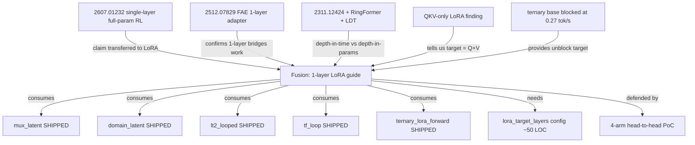

# Research 477: One-Layer Guide — Single-Layer LoRA × RL Steering × Ternary Base Fusion

> **Source:** Fusion of [arXiv:2607.01232](https://arxiv.org/abs/2607.01232) (single-layer full-param RL, Zhang et al. Jul 2026) × [arXiv:2512.07829](https://arxiv.org/abs/2512.07829) (FAE single-layer visual adapter, Gao et al. Dec 2025) × [arXiv:2311.12424](https://arxiv.org/abs/2311.12424) (looped transformers, Yang et al. ICML 2024) × shipped substrate (`mux_latent`, `domain_latent`, `lt2_looped`, `tf_loop`, QKV-only LoRA finding).
> **Date:** 2026-08-12
> **Status:** Active — fusion, defend-wrong PoC pending
> **Related Research:** 018 (Free Transformer mid-layer injection), 028 (HLA), 050 (LDT), 073 (LT2 looped), 097 (training-free looped), 110 (ternary CPU distillation), 165 (Q/K/V sharing), 414 (looped readout blind spot), 453 (variable-rank expert clusters)
> **Classification:** Public

---

## TL;DR

Three recent papers independently show "one layer is enough" across three axes: single-layer **full-param** RL training recovers most of full-model RL gain (2607.01232, mid-layer concentration); a single attention-layer adapter bridges pretrained encoder → diffusion (2512.07829); one weight block executed recurrently matches deep stacks (2311.12424). **No published paper has studied the intersection**: single-layer **LoRA** at one mid-layer of a frozen **ternary** base, with inference-time `mux_latent` + `tf_loop` + `lt2_looped` doing the layer-targeted routing. That intersection is the fusion.

**Distilled for katgpt-rs (modelless, inference-time):** the substrate for *consuming* a single-layer-trained adapter at one mid-layer already ships — `MuxLatentConfig::injection_layer: Option<usize>` (default `n_layer / 2`), `domain_latent` (default-on, injects at `layer_idx == n_layer / 2`), `tf_loop` (re-applies a contiguous mid-stack block with ODE sub-stepping), `lt2_looped` (1 weight block × K iterations, Hybrid 1:4 = 94% of pure SDPA T=4 throughput at 4.6× memory reduction). The `lora.bin` format already supports `n_adapters = 2`. **What is missing**: a training-side `lora_target_layers` config — the current trainer hardcodes all-layers × all-6-targets.

**The load-bearing consequence:** the blocked ternary training measures 0.27 tok/s at seq_len=64 — 5× over budget — partly because it computes LoRA gradients for 64 layers × 6 targets = **384 adapters**. Single-layer Q+V at mid = **2 adapters** = **192× gradient-FLOP reduction**. If single-layer LoRA captures ≥70% of the multi-layer quality gain (a real bet — 2607.01232 proves it for full-param, not LoRA), this turns an infeasible training regime into a feasible one. That is a new capability class, not a perf optimization.

---

## The fusion — what no single paper covers

| Axis | 2607.01232 | 2512.07829 | 2311.12424 + RingFormer + LDT | **This fusion** |
|---|---|---|---|---|
| Update type | full-param | full-param (1 layer) | full-param (1 block, K loops) | **LoRA (rank-r)** |
| Training regime | RL (GRPO/GiGPO/Dr.GRPO) | supervised | supervised + RL unrolling | **RL or supervised** |
| Target layer | mid (data-driven) | mid (encoder→decoder bridge) | whole stack recurrent | **mid (`n_layer/2`)** |
| Base | dense fp16 | dense fp16 | dense fp16 | **ternary {-1,0,+1}** |
| Inference routing | n/a | n/a | recurrent unrolling | **`mux_latent` + `tf_loop` + `lt2_looped`** |

**Why this intersection is interesting, not "yet another single-layer paper":**

1. **Ternary base is the new constraint.** A ternary {-1,0,+1} base has 3 weight levels. `ternary_merge` is grid-aware but rank-16 deltas span ~[-17,+17] → base+delta stay two tensors forever unless the delta itself is ternary (LoTA-QAF). Single-layer LoRA sidesteps the merge problem — only one layer's worth of base+delta needs bridging, not 64.

2. **The 192× gradient reduction attacks the actual blocker.** The ternary training isn't OOM-blocked (23 GB RSS at N=4 is fine); it's step-time-blocked. Per-layer LoRA backward is a meaningful fraction of step time. Cutting 384 adapters → 2 is the highest-leverage fix.

3. **The substrate for consuming a single-layer adapter already ships.** `mux_latent::injection_layer` + `domain_latent` + `tf_loop` compose to route a single-layer-trained adapter into the right place in the forward pass with zero new inference code.

4. **QKV-LoRA works, MLP-only fails (already measured).** Fourier-AHLA distillation: KL 7.4→0.097 with QKV LoRA, fails (KL 9.4) with MLP-only. The target is Q+V at one layer, not all 6 targets × all layers.

---

## The substrate inventory

**Ships (consume, don't duplicate):**

| Substrate | Provides |
|---|---|
| `MuxLatentConfig::injection_layer: Option<usize>` | Default = `n_layer / 2`. The "inject at one mid-layer" mechanism. |
| `domain_latent` (default-on) | `if layer_idx == config.n_layer / 2` injects domain latent. |
| `lt2_looped` | `LoopMode` + `HybridPattern` + `forward_looped`. Bench 033: 94% throughput at 4.6× memory reduction. |
| `tf_loop` | Training-free mid-stack re-application, ODE sub-stepping. |
| QKV-only LoRA finding | Fourier-AHLA: QKV-LoRA works (KL 7.4→0.097), MLP-only fails (KL 9.4). Tells us the target. |
| `ternary_lora_forward` | `y = W_ternary·x + scale·B·(A·x)` with `LoraDelta::{Dense, Ternary}`. |
| `lora.bin` format | `n_adapters` is a u32 field — already supports `n_adapters = 2`. Loader needs no change. |
| LoTA-QAF ternary merge | `ternary_merge` + `QuantGrid` (grid-aware merge settled). |

**Missing (the actual gap, ~50 LOC):**

- `TrainingConfig::lora_target_layers: Option<Vec<usize>>` + `lora_targets: Option<Vec<CpuLoraTarget>>`, both default `None` (= current behavior)
- `CpuLoraTrainer::new` loop change: skip layers/targets not in the configured set
- Adapter-index lookup may need a sparse map if it assumes contiguous `n_layer × 6` layout

---

## Connection map

---

## Latent vs raw boundary

Training-side only — the LoRA delta is dense f16 (or ternary via LoTA-QAF), trained via gradient descent. The sync-boundary rule does NOT apply during training.

At inference, the single-layer LoRA is consumed locally (no sync). The trained adapter is committed via `MerkleFrozenEnvelope` (BLAKE3 on `lora.bin`). The 5 synced affect scalars cross the chain boundary as raw scalars, NOT as the LoRA itself. No new sync-boundary concern.

The single-layer-trained adapter is a **frozen latent-state artifact** in the neuron-db sense — persists via freeze/thaw, BLAKE3-committed, consumed read-only at inference.

---

## What stays public vs private

- **Public (`katgpt-rs`):** inference-side consumer — `mux_latent` ships; the one gap is ensuring `LoraAdapter::load` handles small `n_adapters` files cleanly (1-line audit). This note is public.
- **Private (`riir-train`):** the `lora_target_layers` config + PoC recipes + measured GOAT-gate numbers.
- **Private (`riir-ai`) — deferred until PoC passes:** the guide for "single-layer steering vs policy improvement" — which layers, which targets, which RL algorithms benefit most. This is the selling-point moat.

---

## Validation — defend-wrong PoC (per research-skill §3.6)

PoC location: `riir-train/.issues/` (PoC task per AGENTS.md). Three+ competitors head-to-head on Gemma-2-2B (the fast baseline, ~19 s/step natively → 1000-step PoC ≈ 5 hours, affordable per §3.5 Path 0.5).

| Arm | `lora_target_layers` | `lora_targets` | Adapter count | Tests |
|---|---|---|---|---|
| **A — Baseline (full)** | `None` | `None` | `n_layer × 6` | current behavior |
| **B — Single-layer Q+V at mid** | `Some([n_layer / 2])` | `Some([Q, V])` | **2** | the fusion claim |
| **C — Single-layer all-6 at mid** | `Some([n_layer / 2])` | `None` | **6** | target-count ablation |
| **D — All-layer Q+V only** | `None` | `Some([Q, V])` | `n_layer × 2` | QKV-only finding at scale |

**Gates:**
- **G1** (non-degenerate loss): monotonically decreasing, no NaN
- **G2** (perf): B s/step ≤ 0.10 × A s/step (≥10× speedup minimum)
- **G3** (no-regression): existing tests pass with `None, None` default
- **G4** (quality — load-bearing): B quality ≥ 0.70 × A quality on HumanEval pass@1 (or the metric the Gemma-2-2B baseline specifies)

The 70% bar (not 90%) is honest — 2607.01232's 90%+ is full-param; LoRA's rank-r constraint will lose some of the high-contribution directions. PoC defends OR refutes; either outcome recorded as §9 PoC Addendum.

If PoC passes G2+G4: re-run on Ternary-Bonsai-27B (seq_len=64, gate ≤60 s/step). If that passes, the blocked ternary training unblocks → **Super-GOAT** (new capability class: previously-infeasible training becomes feasible).

---

## §3.5 modelless-unblock check (mandatory, done)

| Path | Verdict |
|---|---|
| Path 0 (training-target decomposition) | Math decomposes; `ternary_lora_forward` ships. NOT a deferral. |
| Path 1 (freeze/thaw correction) | NO — needs gradient signal |
| Path 2 (deterministic LoRA) | YES for **steering** claim (deterministically-constructed reader-LoRA at mid-layer, no GD); NO for **policy improvement** |
| Path 3 (latent projection) | YES for steering (`mux_latent` does this); NO for policy improvement |
| Path 0.5 (training-cost-weighted) | YES — Gemma-2-2B PoC at ~5 hours affordable; Bonsai-27B ~10× slower |

**Split verdict:** the **steering** arm is modelless-validable via Path 2+3 — a deterministically-constructed reader-LoRA at mid-layer works without gradient descent. The **policy improvement** arm is genuinely training-bound. The PoC tests the policy-improvement arm because that's the load-bearing one for the ternary unblock.

---

## Verdict

**Tier today: Gain** — the `lora_target_layers` config is a small actionable improvement regardless of PoC outcome. **Upgrade ladder:**
- PoC G2 PASS, G4 FAIL → **Gain** (perf-only optimization, negative quality result documented, do NOT promote)
- PoC G2 + G4 PASS, ternary re-run FAIL → **GOAT** (works for dense, not ternary — forward-path-bound)
- PoC G2 + G4 PASS, ternary re-run PASS → **Super-GOAT** (new capability class: previously-infeasible 27B ternary training becomes feasible at 1/192nd gradient FLOPs)

Per research-skill §1.5, not writing "candidate" until the PoC commits Q2/Q3 — the guide in `riir-ai/.research/` lands when Super-GOAT confirms.

### Novelty gate (Q1–Q4)

| Q | Criterion | Status |
|---|---|---|
| Q1 No prior art? | **✅** — web search confirms no paper benchmarks single-layer LoRA vs multi-layer on RLHF/GRPO. Closest adjacent is single-rank-1-LoRA emergent-misalignment (negative behavior-shift, not steering quality). |
| Q2 New behavior class? | **⏳** — YES if 192× reduction makes a previously-infeasible training regime feasible (new capability class); NO if quality drops below 70% (perf only). |
| Q3 Product selling point? | **⏳** — "trains a 27B ternary base in 1/192nd the gradient FLOPs" IF quality holds. |
| Q4 Force multiplier? | **✅** — connects LT2 + mux_latent + ternary base + QKV-only finding + freeze/thaw + LoTA-QAF. |

### MOAT gate per domain

- **katgpt-rs:** the open primitive is the inference-side consumer (loader audit for small `n_adapters`). In scope.
- **riir-train:** the training-side config + PoC. Active moat — model-based track actively pursued.
- **riir-ai:** deferred until PoC passes — the private steering-vs-policy guide is the moat.

---

## Risks

1. **Quality (HIGH):** 2607.01232's 90%+ is full-param; LoRA's rank-r constraint may lose the high-contribution directions. The 70% bar in G4 is honest.
2. **Speedup (MEDIUM):** 192× adapter-count reduction → gradient-FLOP reduction, but step time also includes the forward pass (attention + SSM + RoPE). If the LoRA backward is only 20% of step time, 192× reduction yields only ~1.25× step speedup. PoC arm B measures s/step directly.
3. **Target selection (LOW):** 2607.01232 found middle-layer concentration on Qwen3/Qwen2.5; Bonsai is Qwen3.6-27B (same family). Specific best layer may not be exactly `n_layer / 2`; arm C vs B tests target count, arm D tests Q+V vs all-6.

---

## Implementation priority

| Priority | Task | Gate |
|---|---|---|
| P0 | `lora_target_layers` + `lora_targets` config in `TrainingConfig` + `CpuLoraTrainer::new` | clippy + existing tests |
| P0 | 4-arm head-to-head PoC on Gemma-2-2B | G1+G2+G3+G4 |
| P1 | If PoC passes: re-run on Ternary-Bonsai-27B with single-layer Q+V | ≤60 s/step at seq_len=64 |
| P1 | If PoC passes: audit `LoraAdapter::load` for small `n_adapters` files | loader tests |
| P2 | If PoC passes strongly: private guide in `riir-ai/.research/` for steering-vs-policy split | doc |
| P3 | RL variant: single-layer Q+V LoRA under GRPO on Gemma-2-2B | supervised PoC passes first |

---

## Non-goals

- Not proving single-layer LoRA matches full-param RL (2607.01232 already proved that for full-param; we test the LoRA variant).
- Not replacing `lt2_looped` or `tf_loop` — these ship and are complementary (inference-time depth; this fusion handles training-time cost).
- Not changing the `lora.bin` wire format — already supports variable `n_adapters`.
- Not touching the sync boundary — single-layer LoRA is local-only at inference, committed via existing freeze/thaw envelope.

---

## References

1. **[arXiv:2607.01232]** Zhang, Hu, Glentis, Li, Yau, Lin, Hong. *Is One Layer Enough? Training A Single Transformer Layer Can Match Full-Parameter RL Training*. Jul 2026.
2. **[arXiv:2512.07829]** Gao, Chen, Chen, Gu. *One Layer Is Enough: Adapting Pretrained Visual Encoders for Image Generation*. Dec 2025.
3. **[arXiv:2311.12424]** Yang et al. *Looped Transformers are Better at Learning Learning Algorithms*. ICML 2024.
4. **[arXiv:2502.13181]** Heo et al. *RingFormer*. Feb 2025.
5. **[arXiv:2605.08605]** Davis. *Lattice Deduction Transformer*. May 2026.
6. **[arXiv:2309.01826]** Pires et al. *One Wide Feedforward is All You Need*. Oct 2023. — adjacent (FFN sharing/dropping for MT).
7. Research 073 — LT2 (closest shipped cousin in this repo).
